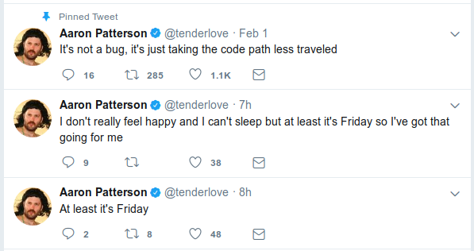

# La programmation avec Ruby
## 🖥 ⌨ 🤓

notes:
- Présentation et commandes de bases
- LiveCode
- Jeux

---

## Pourquoi Ruby ? 🤔

<!-- > A dynamic, open source programming language with a focus on simplicity and productivity.

> It has an elegant syntax that is natural to read and easy to write. -->

> Un langage open-source dynamique qui met l'accent sur la simplicité et la productivité.

> Sa syntaxe élégante en facilite la lecture et l'écriture.

## 👌

notes:
Yukihiro « Matz » Matsumoto est le créateur de Ruby. Frustré par son expérience en développement Smalltalk et Lisp, il débute la conception d'un nouveau langage en 1993 sous Emacs, puis publie une première version en 1995.

vvv

## Ruby on Rails
Framework pour applications web

&nbsp;

##### Développés avec Ruby on Rails :


...

notes:
- GitHub
- AirBnB
- SoundCloud
- Product Hunt
- Twitch
- ZenDesk

---

## Hello, World! 👋 🌍

&nbsp;

```ruby
puts "Hello Nantes !"
```

---

## Types 🔖

<table>
    <tr>
        <td>`"Double arc-en-ciel"`</td>
        <td>_**String**_</td>
        <!-- .element: class="fragment" data-fragment-index="2" -->
    </tr>
    <tr>
        <td>`42`</td>
        <td>_**Integer**_</td>
        <!-- .element: class="fragment" data-fragment-index="3" -->
    </tr>
    <tr>
        <td>`3.14159`</td>
        <td>_**Float**_</td>
        <!-- .element: class="fragment" data-fragment-index="4" -->
    </tr>
    <tr>
        <td>`["Licorne", "Chaton", "Insecte"]`</td>
        <td>_**Array**_</td>
        <!-- .element: class="fragment" data-fragment-index="5" -->
    </tr>
    <tr>
        <td>`true`</td>
        <td>_**TrueClass**_</td>
        <!-- .element: class="fragment" data-fragment-index="6" -->
    </tr>
    <tr>
        <td>`false`</td>
        <td>_**FalseClass**_</td>
        <!-- .element: class="fragment" data-fragment-index="7" -->
    </tr>
</table>
<!-- .element: class="fragment" data-fragment-index="1" -->

Et quelques autres...
<!-- .element: class="fragment" data-fragment-index="8" -->

vvv

### Le hash 📔

```ruby
student = {
  "first_name" => "Nicolas",
  "age"        => 27,
}
```

<p>Un hash est une collection de paire **clé/valeur**</p>
<!-- .element: class="fragment" data-fragment-index="1" -->

```ruby
{
  "key"       => "value",
  "other_key" => "other value"
}
```
<!-- .element: class="fragment" data-fragment-index="2" -->

vvv

### Le hash 📔 (suite)

#### Accès à une valeur 🔍

```ruby
student = {
  "first_name" => "Nicolas",
  "age"        => 27,
}
```

```ruby
puts student["first_name"]

# => Nicolas
```

---

## Variables 🎁

&nbsp;

```ruby
year = 2020
puts year
```

👉<!-- .element: class="fragment" data-fragment-index="1" -->
`2020`<!-- .element: class="fragment" data-fragment-index="1" -->

&nbsp;

### 🎉
<!-- .element: class="fragment" data-fragment-index="2" -->

```ruby
year = year + 1
puts year
```
<!-- .element: class="fragment" data-fragment-index="2" -->

👉<!-- .element: class="fragment" data-fragment-index="3" -->
`2021`<!-- .element: class="fragment" data-fragment-index="3" -->

notes:

---

## Les fondamentaux 🛠

vvv

## Conditions ✅ ❎

```ruby
weather = "Il pleut"

if weather == "Il pleut"
  puts "Prenez votre parapluie 🌂"
end
```

&nbsp;

```ruby
weather = "Il fait beau"

if weather == "Il pleut"
  puts "Prenez votre parapluie 🌂"
else
  puts "Pensez à vos lunettes de soleil 😎"
end
```
<!-- .element: class="fragment" data-fragment-index="1" -->

notes: ⚠ Tout est vrai sauf _false_ ou _nil_

vvv

## Opérateurs logiques ☯️
#### Logical AND
```ruby
result = a && b
```

<table>
    <thead>
      <tr>
        <td>a</td>
        <td>b</td>
        <td>**result**</td>
      </tr>
    </thead>
    <tr>
        <td>false</td>
        <td>false</td>
        <td>_**false**_</td>
    </tr>
    <tr>
        <td>true</td>
        <td>false</td>
        <td>_**false**_</td>
    </tr>
    <tr>
        <td>false</td>
        <td>true</td>
        <td>_**false**_</td>
    </tr>
    <tr>
        <td>true</td>
        <td>true</td>
        <td style="color: red">_**true**_</td>
    </tr>
</table>

notes:
rain = true
wind = true

if rain && wind
  puts "Restez à la maison !"
end

vvv

### Opérateurs logiques (suite)
#### Logical OR
```ruby
result = a || b
```

<table>
    <thead>
      <tr>
        <td>a</td>
        <td>b</td>
        <td>**result**</td>
      </tr>
    </thead>
    <tr>
        <td>false</td>
        <td>false</td>
        <td>_**false**_</td>
    </tr>
    <tr>
        <td>true</td>
        <td>false</td>
        <td style="color: red">_**true**_</td>
    </tr>
    <tr>
        <td>false</td>
        <td>true</td>
        <td style="color: red">_**true**_</td>
    </tr>
    <tr>
        <td>true</td>
        <td>true</td>
        <td style="color: red">_**true**_</td>
    </tr>
</table>

notes:
day = "Saturday"

if day == "Saturday" || day == "Sunday"
  puts "C'est le week end !"
end

vvv

### Opérateurs logiques (suite)
#### Logical NOT
```ruby
result = !a
```

<table>
    <thead>
      <tr>
        <td>a</td>
        <td>**result**</td>
      </tr>
    </thead>
    <tr>
        <td>false</td>
        <td>_**true**_</td>
    </tr>
    <tr>
        <td>true</td>
        <td style="color: red">_**false**_</td>
    </tr>
</table>

notes:
sunny = true

if !sunny
  puts "Bon finalement, on va pas à la mer"
end

vvv

## Boucles 🔁

#### For

```ruby
for number in 1..10
  puts number
end
```

vvv


### Boucles (suite) 🔁

#### While

```ruby
counter = 1

while counter < 20
  puts counter
  counter = counter + 1
end
```

#### Until
<!-- .element: class="fragment" data-fragment-index="2" -->

```ruby
counter = 23

until counter % 10 == 0
  counter = counter + 1
end
puts counter
```
<!-- .element: class="fragment" data-fragment-index="2" -->

⚠ Attention aux boucles infinies ! ⚠
<!-- .element: class="fragment" data-fragment-index="3" -->

notes: Faire tourner les boucles au tableau
exercice multiplication
```ruby
counter = 1
while counter < 11
  puts counter * 7
  counter = counter + 1
end
```

vvv

### Boucles (fin) 🔁

#### .each

```ruby
students = ["sarah", "guillaume", "maël", "marine", "pierre", "camille"]

students.each do |student|
  puts student.capitalize
end
```

---

## Méthodes 🏭

&nbsp;

Arranger la logique par _boite noire_
```ruby
def hello_world
  puts "Bonjour tout le monde !"
end

hello_world
```


```ruby
def greetings(name)
  puts "Bonjour " + name
end

greetings("Pierre")
```
<!-- .element: class="fragment" data-fragment-index="1" -->

---

## Paradigme Ruby 👴🏻☝

&nbsp;

"Tout est objet."

notes: Language orienté objets. Il existe des languages impératifs, des langages fonctionnels...

vvv

## Objet ?

# 🚗

<table>
    <theader>
      <th>Caractéristiques</td>
      <th>Comportements</td>
    </theader>
    <tr>
        <td>Marque : `Simca`</td>
        <td>`Démarrer`</td>
    </tr>
    <tr>
        <td>Couleur : `rouge`</td>
        <td>`Tourner à droite`</td>
    </tr>
    <tr>
        <td>...</td>
        <td>...</td>
    </tr>
</table>
<!-- .element: class="fragment" data-fragment-index="1" -->

notes: Un objet est une entité qui contient des informations et des mécanismes concernant un sujet, manipulés dans un programme

---

# LiveCode
# ⌨

notes:
```ruby
# TODO
# - Le programme choisi un nombre entre 1 et 50
#   et demande à l'utilisateur de renseigner un nombre entre 1 et 50
#
# - Si l'utilisateur trouve le bon 'prix', il gagne
#   Sinon le programme l'aide en lui disant '+' ou '-'
```

---

## Jeux 🎮

🔗 http://tiny.cc/ruby_101
<!-- https://repl.it/languages/ruby -->

vvv

### Jeux 🎮

#### 👉 Découverte de l'environnement de dev
```ruby
# Expected result:
sum(2, 5)
# => 7

sum(36, 6)
# => 42
```

```ruby
# Indice et Pseudocode
def sum(a, b)
  # sum a and b
  # return result
end
```
<!-- .element: class="fragment" data-fragment-index="1" -->

vvv

### Jeux (solution) 🎮

#### 👉 Découverte de l'environnement de dev

```ruby
# Solution
def sum(a, b)
  c = a + b
  return c
end
sum(2, 5)
sum(36, 6)
```

vvv

#### 👉 Autoriser l'accès grâce au mot de passe "LeWagon"
```ruby
# Expected result:
grant_access("123456")
# => "Accès refusé"

grant_access("LeWagon")
# => "Bienvenue, vous allez changer de vie"
```

```ruby
# Indice et Pseudocode
def grant_access(given_password)
  real_password = "LeWagon"
  # Si le mot de passe donné est même que le bon mot de passe :
    puts "...?" # j'affiche le message de bienvenue
  # sinon
    puts "...?" # j'affiche le message d'accès refusé
  # fin
end
```
<!-- .element: class="fragment" data-fragment-index="1" -->

vvv

### Jeux (solution) 🎮

#### 👉 Autoriser l'accès grâce au mot de passe "LeWagon"

```ruby
# Solution
def grant_access(given_password)
  real_password = "LeWagon"
  if given_password == real_password
    puts "Bienvenue, vous allez changer de vie"
  else
    puts "Accès refusé"
  end
end
grant_access("123456")
grant_access("LeWagon")
```

vvv

### Comment afficher un tweet ?


<!-- .element: class="is-big" -->

<table>
    <tr>
        <td>`author`</td>
        <!-- .element: class="fragment" data-fragment-index="1" -->
        <td>`content`</td>
        <!-- .element: class="fragment" data-fragment-index="2" -->
        <td>`date`</td>
        <!-- .element: class="fragment" data-fragment-index="3" -->
    </tr>
</table>

vvv

### Comment afficher un tweet ? (suite)

Le hash 📔 !

```ruby
tweet = {
  "author"  => "Le Wagon Nantes",
  "content" => "Ruby on Rails c'est trop cool ! 🤩",
  "date"    => "29 janvier"
}
```

Résultat attendu 🖥
<!-- .element: class="fragment" data-fragment-index="1" -->

```html
Le Wagon Nantes - 29 janvier
> Ruby on Rails c'est trop cool ! 🤩
---
```
<!-- .element: class="fragment" data-fragment-index="1" -->

Code ⌨
<!-- .element: class="fragment" data-fragment-index="2" -->

```ruby
puts tweet["author"] + ' - ' + tweet["date"]
puts '> ' + tweet["content"]
puts '---'
```
<!-- .element: class="fragment" data-fragment-index="2" -->

vvv

### Afficher plusieurs tweets 🐦🐦🐦


<!-- .element: class="is-big" -->

vvv

### Afficher plusieurs tweets 🐦🐦🐦

Comment ? 🤔

<p>
<span>Un `array`</span>
<!-- .element: class="fragment" data-fragment-index="1" -->

<span>de `hashes`</span>
<!-- .element: class="fragment" data-fragment-index="2" -->

</p>

```ruby

tweets = [
  {
    "author"  => "Le Wagon Nantes",
    "content" => "Ruby on Rails c'est trop cool ! 🤩",
    "date"    => "29 janvier"
  },
  {
    "author"  => "Le Wagon Nantes & Rennes",
    "content" => "Prochaine session le 5 juillet à Nantes 😍",
    "date"    => "29 janvier"
  },
   {
    "author"  => "Le Wagon Nantes & Rennes",
    "content" => "Prochaine session le 22 mars à Rennes 😍",
    "date"    => "29 janvier"
  },
]
```
<!-- .element: class="smaller-text fragment" data-fragment-index="3" -->

vvv

### Afficher plusieurs tweets 🐦🐦🐦

Résultat attendu 🖥

```html
Le Wagon Nantes & Rennes - 29 janvier
> Ruby on Rails c'est trop cool ! 🤩
---
Le Wagon Nantes & Rennes - 29 janvier
> Prochaine session le 5 juillet à Nantes 😍
---
Le Wagon Nantes & Rennes - 29 janvier
> Prochaine session le 22 mars à Rennes 😍
---
```
<!-- .element: class="smaller-text" -->

Code ⌨
<!-- .element: class="fragment" data-fragment-index="1" -->

```ruby
for tweet in tweets # OU tweets.each do |tweet|
  puts tweet["author"] + ' - ' + tweet["date"]
  puts '> ' + tweet["content"]
  puts '---'
end
```
<!-- .element: class="fragment" data-fragment-index="1" -->

---

# Questions
# 💬❔

vvv

## Disponible sur GitHub 🙏

&nbsp;

🔗 https://github.com/nantesrb/ruby_101
